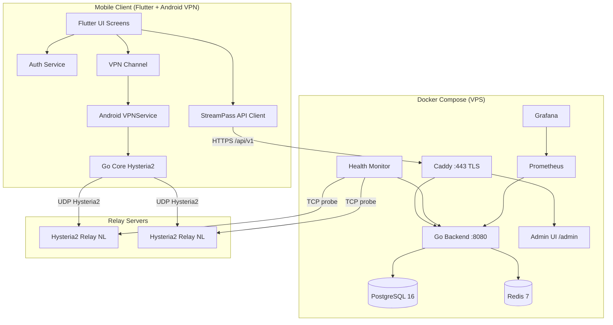
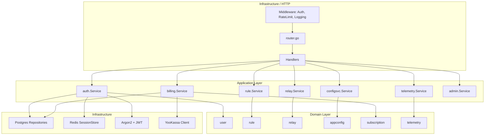
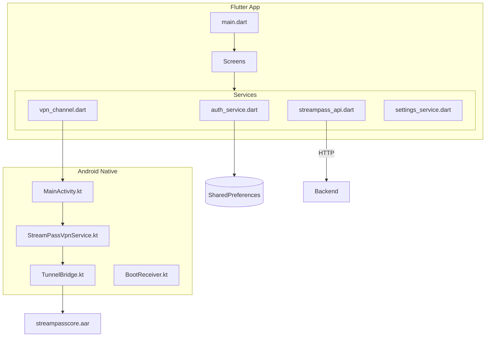
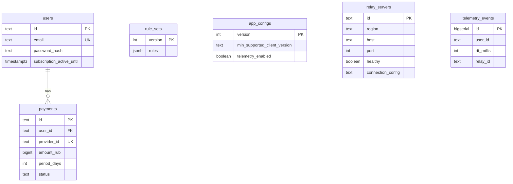

# StreamPass — Архитектура

> Дата: 2026-08-07 | Версия: 1.2

---

## 1. Общая схема системы



> Go Core: real Hysteria2 transport + Decision Engine (не stub). Prod relays: NL only; multi-region software ready.

---

## 2. Backend Architecture (Clean Architecture)



**Composition root:** `backend/cmd/server/main.go`

---

## 3. Frontend / Mobile Architecture



**Экраны:** onboarding, home, servers/regions, subscription, settings, exclusions, statistics, diagnostics.

---

## 4. Database



Подробнее: `docs/09_Database.md`

---

## 5. Infrastructure

| Компонент | Технология | Конфиг |
|-----------|------------|--------|
| Reverse Proxy | Caddy 2 | `Caddyfile` |
| Backend | Go 1.22, distroless | `backend/Dockerfile` |
| Health Monitor | Go worker | `backend/cmd/healthmonitor/Dockerfile` |
| Admin UI | Static files | `admin/` via Caddy `/admin/` |
| Database | PostgreSQL 16-alpine | `docker-compose.yml` |
| Cache | Redis 7-alpine | `docker-compose.yml` |
| Metrics | Prometheus + Grafana | `infrastructure/` |
| TLS | Caddy auto-HTTPS | `212-43-156-33.nip.io` |
| Backups | Daily cron | BL-033 |

---

## 6. Взаимодействие сервисов

### Auth Flow
```
Client → POST /api/v1/register → Backend → Argon2id hash → Postgres
Client → POST /api/v1/login → Backend → JWT pair → Redis session
Client → GET /api/v1/servers → Bearer JWT → Backend validates → Postgres
```

### Relay Health Flow
```
Healthmonitor → GET /api/v1/servers/all (X-Admin-Key) → Backend
Healthmonitor → TCP probe each relay host:port
Healthmonitor → POST /api/v1/servers/health → Backend → Postgres update
Client → GET /api/v1/servers (Bearer) → filtered healthy relays
```

### Billing Flow
```
Client → POST /api/v1/payments (Bearer) → Backend → YooKassa CreatePayment
Client → opens confirmation_url in browser
YooKassa → POST /api/v1/payments/webhook → Backend → verify → extend subscription
Client → GET /api/v1/subscription → active_until
```

---

## 7. Planned Architecture (NOT YET / OPTIONAL)

Остаётся вне текущего MVP-закрытия:

- Platform Adapters: WFP (Windows), Network Extension (macOS/iOS) — BL-023…025
- TCP underlay fallback Done (BL-017): framed TCP→UDP on VPS + client candidates
- Off-site backup copy Done (BL-035): encrypt → second host + PC pull
- ЮKassa live payment verification (BL-004 Skipped; BL-030 Blocked)

---

## 8. Клиентская маршрутизация (Routing Policy)

**Источник истины:** [`docs/07.4_RoutingPolicy.md`](07.4_RoutingPolicy.md).

Порядок слоёв: DNS Resolver → Rule Engine → Decision Engine → Route Manager → Transport.  
Transport / VpnService **не** принимают продуктовые решения (запрет `UDP/443→DIRECT` как политики).  
DIRECT / RELAY / FALLBACK — см. 07.4; app-bypass vs domain DIRECT — см. [`docs/33_DirectVsVpnBypass.md`](33_DirectVsVpnBypass.md).

---

## 9. Ключевые файлы

| Файл | Назначение |
|------|------------|
| `docs/07.4_RoutingPolicy.md` | Политика DIRECT / RELAY / FALLBACK |
| `backend/cmd/server/main.go` | Composition root |
| `backend/internal/infrastructure/http/router/router.go` | All routes |
| `backend/internal/infrastructure/postgres/migrations/` | DB schema |
| `client/lib/main.dart` | Flutter entry + API URL |
| `client/android/.../StreamPassVpnService.kt` | VPN TUN |
| `client/go_core/mobile/tunnel.go` | Hysteria2 tunnel + Decision Engine |
| `admin/` | Operator Admin UI |
| `docker-compose.yml` | Full stack |
| `shared/config/` | YAML config loader |
