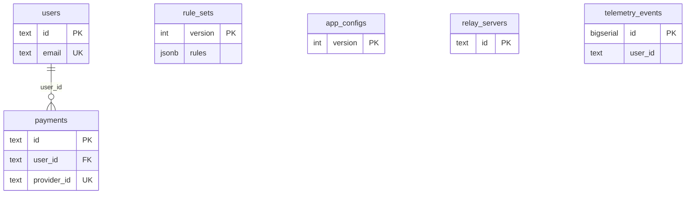

# StreamPass — Database

> Дата: 2026-08-03 | СУБД: PostgreSQL 16

---

## 1. СУБД

| Параметр | Значение |
|----------|----------|
| Engine | PostgreSQL 16-alpine |
| Driver | github.com/lib/pq (vendored) |
| Connection pool | max_open=20, max_idle=5, lifetime=30m |
| SSL | disable (Docker internal network) |
| Migrations | Auto-apply at startup via go:embed |

---

## 2. Таблицы

### users

| Column | Type | Constraints |
|--------|------|-------------|
| id | TEXT | PRIMARY KEY |
| email | TEXT | NOT NULL, UNIQUE |
| password_hash | TEXT | NOT NULL |
| created_at | TIMESTAMPTZ | NOT NULL |
| updated_at | TIMESTAMPTZ | NOT NULL |
| subscription_active_until | TIMESTAMPTZ | NULLABLE |

**Indexes:** `idx_users_email`

### payments

| Column | Type | Constraints |
|--------|------|-------------|
| id | TEXT | PRIMARY KEY |
| user_id | TEXT | NOT NULL, FK → users(id) |
| provider_id | TEXT | NOT NULL, UNIQUE |
| amount_rub | BIGINT | NOT NULL |
| period_days | INTEGER | NOT NULL |
| status | TEXT | NOT NULL |
| created_at | TIMESTAMPTZ | NOT NULL |

**Indexes:** `idx_payments_user_id`, `idx_payments_provider_id`

### rule_sets

| Column | Type | Constraints |
|--------|------|-------------|
| version | INTEGER | PRIMARY KEY |
| rules | JSONB | NOT NULL |
| created_at | TIMESTAMPTZ | NOT NULL |

Immutable versioning: каждый publish = новая version.

### app_configs

| Column | Type | Constraints |
|--------|------|-------------|
| version | INTEGER | PRIMARY KEY |
| min_supported_client_version | TEXT | NOT NULL |
| telemetry_enabled | BOOLEAN | NOT NULL |
| rule_poll_interval_sec | INTEGER | NOT NULL |
| relay_poll_interval_sec | INTEGER | NOT NULL |
| updated_at | TIMESTAMPTZ | NOT NULL |

### relay_servers

| Column | Type | Constraints |
|--------|------|-------------|
| id | TEXT | PRIMARY KEY |
| region | TEXT | NOT NULL |
| host | TEXT | NOT NULL |
| port | INTEGER | NOT NULL |
| healthy | BOOLEAN | NOT NULL DEFAULT false |
| load_ratio | DOUBLE PRECISION | NOT NULL DEFAULT 0 |
| rtt_millis | INTEGER | NOT NULL DEFAULT 0 |
| updated_at | TIMESTAMPTZ | NOT NULL |
| connection_config | TEXT | NOT NULL DEFAULT '' |

Migration 0002 добавила `connection_config`.

### telemetry_events

| Column | Type | Constraints |
|--------|------|-------------|
| id | BIGSERIAL | PRIMARY KEY |
| user_id | TEXT | NOT NULL (no FK) |
| rtt_millis | INTEGER | NOT NULL |
| packet_loss_pct | DOUBLE PRECISION | NOT NULL |
| relay_id | TEXT | NOT NULL |
| client_version | TEXT | NOT NULL |
| os | TEXT | NOT NULL |
| connect_millis | INTEGER | NOT NULL |
| error_code | TEXT | NOT NULL DEFAULT '' |
| recorded_at | TIMESTAMPTZ | NOT NULL |

**Indexes:** `idx_telemetry_events_user_id`, `idx_telemetry_events_recorded_at`

**Design:** No PII, no URLs, no browsing history by design.

### schema_migrations

| Column | Type | Constraints |
|--------|------|-------------|
| filename | TEXT | PRIMARY KEY |
| applied_at | TIMESTAMPTZ | NOT NULL |

---

## 3. Связи

- `payments.user_id` → `users.id` (FK with ON DELETE implicit)
- `telemetry_events.user_id` — TEXT без FK (by design, для performance)
- `rule_sets`, `app_configs`, `relay_servers` — standalone

---

## 4. Миграции

| File | Description |
|------|-------------|
| `0001_init.up.sql` | Initial schema (all tables) |
| `0001_init.down.sql` | Drop all tables |
| `0002_relay_connection_config.up.sql` | ADD connection_config to relay_servers |
| `0002_relay_connection_config.down.sql` | DROP connection_config |

**Path:** `backend/internal/infrastructure/postgres/migrations/`  
**Runner:** `backend/internal/infrastructure/postgres/migrate.go`

---

## 5. Redis (Sessions)

Не PostgreSQL, но связан с auth:

| Key pattern | Value | TTL |
|-------------|-------|-----|
| `session:<refresh_token_hash>` | user_id | 720h (refresh_ttl) |

**Client:** Custom RESP2 — `backend/internal/infrastructure/redisclient/`

---

## 6. Backup

Автоматический backup: `scripts/backup-postgres.sh` + daily cron (BL-033). См. `docs/27_BackupRecovery.md`.  
Volume: `postgres_data` в docker-compose.  
См. `docs/27_BackupRecovery.md`
